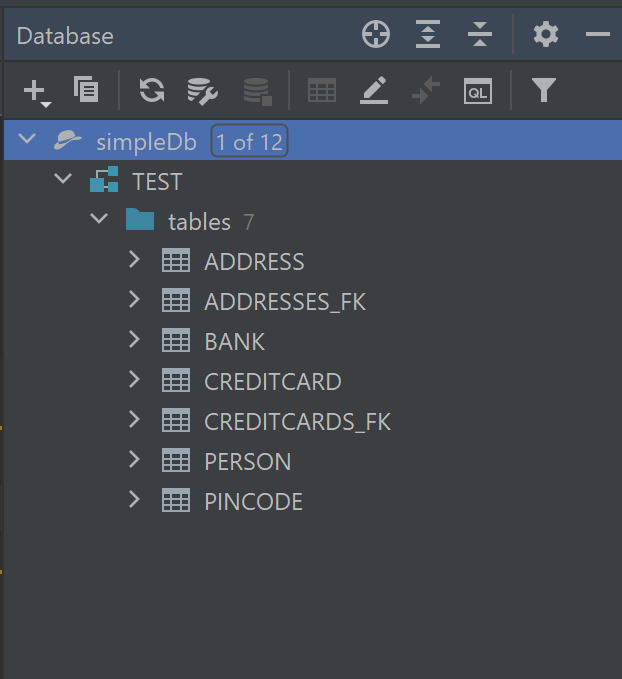
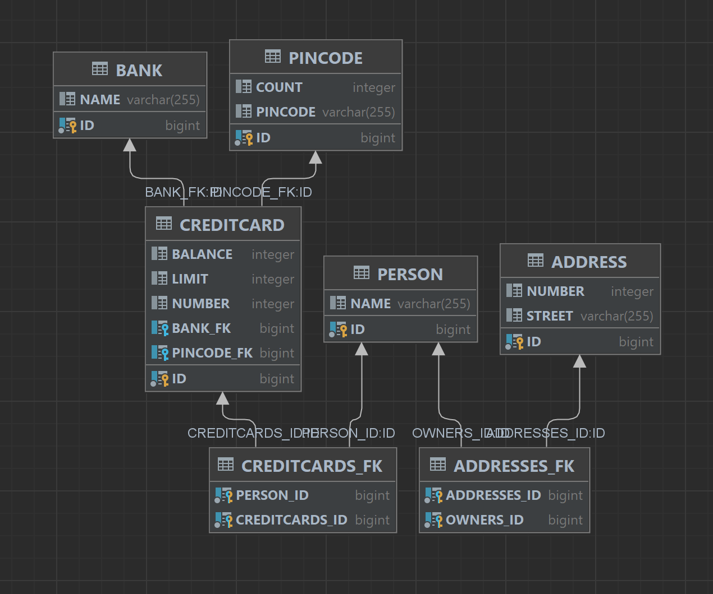

## Report for "Software Technology Experiment 2: JPA":

### Project URL:
https://github.com/LisaEliassen/dat250-jpa-example

### Technical Problems:
It is technically not a technical problem, but I struggled with inspecting the 
database at first, before being told by a fellow student that the way to do it 
was to get a student licence for IntelliJ Ultimate, download it, and then use 
the Database Tool Window.

### Database inspection:
When having the project open in IntelliJ Ultimate edition, I clicked View in the 
upper toolbar, then Tool Windows, then Database, and then I added the database 
by clicking +/New, chose the Data Source to be Apache Derby, typed in the path to
the database which I have called simpleDB, typed in the test for both user and password 
and lastly clicked OK. I clicked Refresh to see all the data/tables.

To see the database schema, I right-clicked TEST under the database, then Diagrams
and lastly Show Visualization.

Database Schema:

### Issues I did not manage to solve:
None :)

