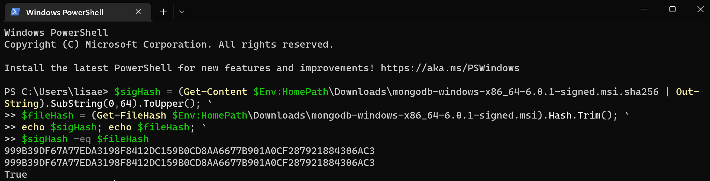
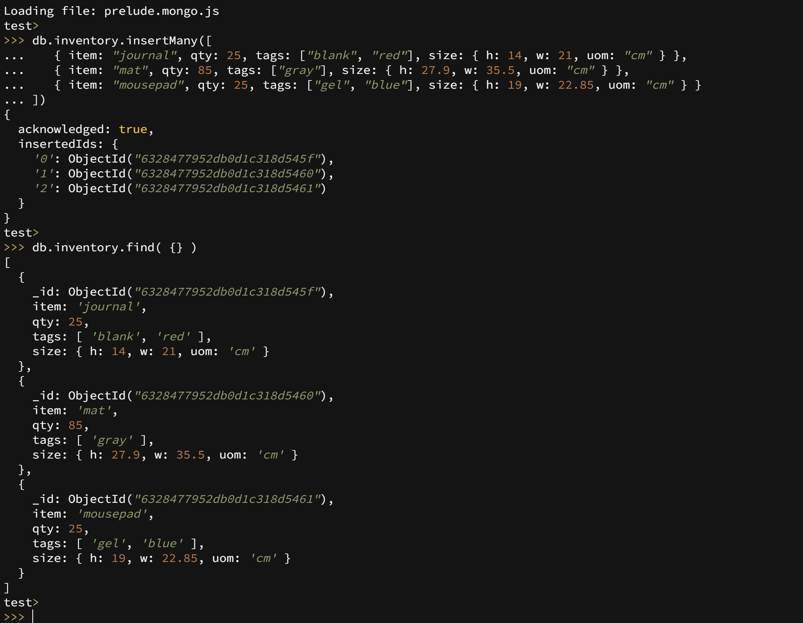
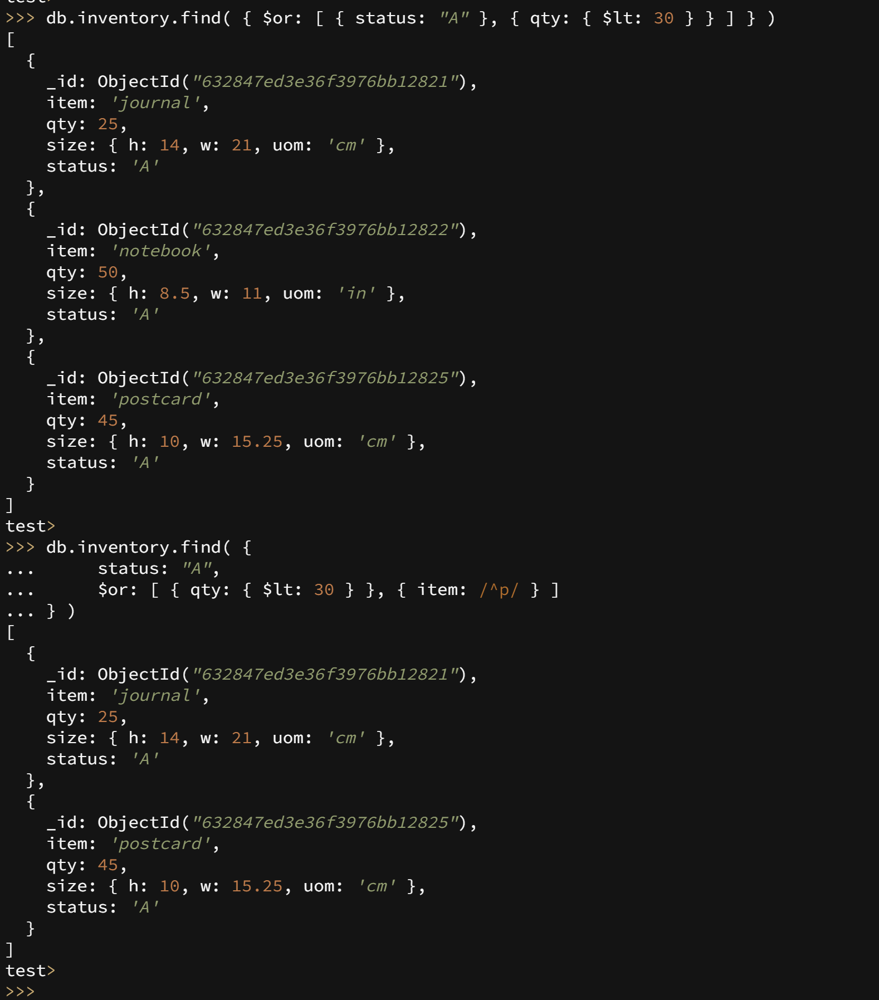
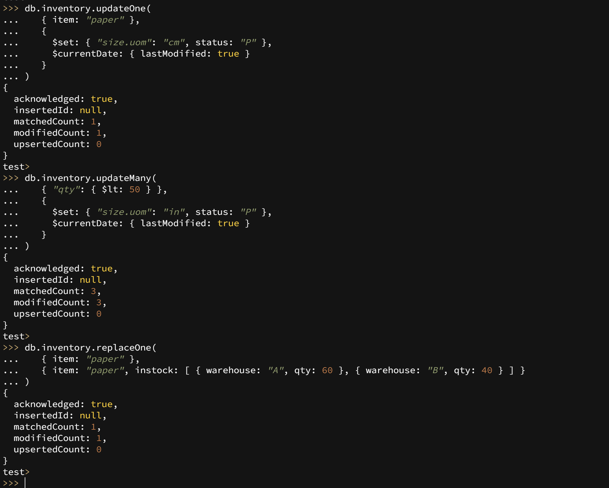
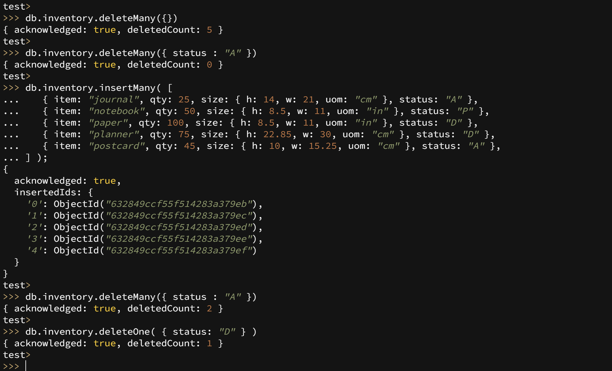
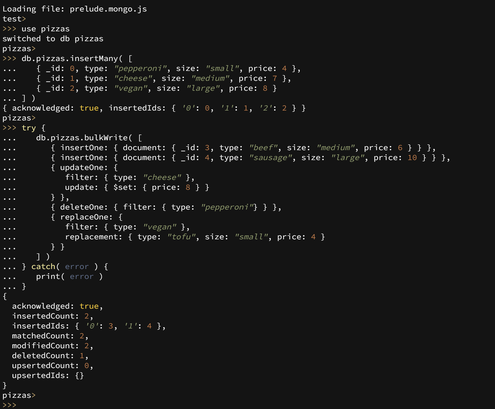
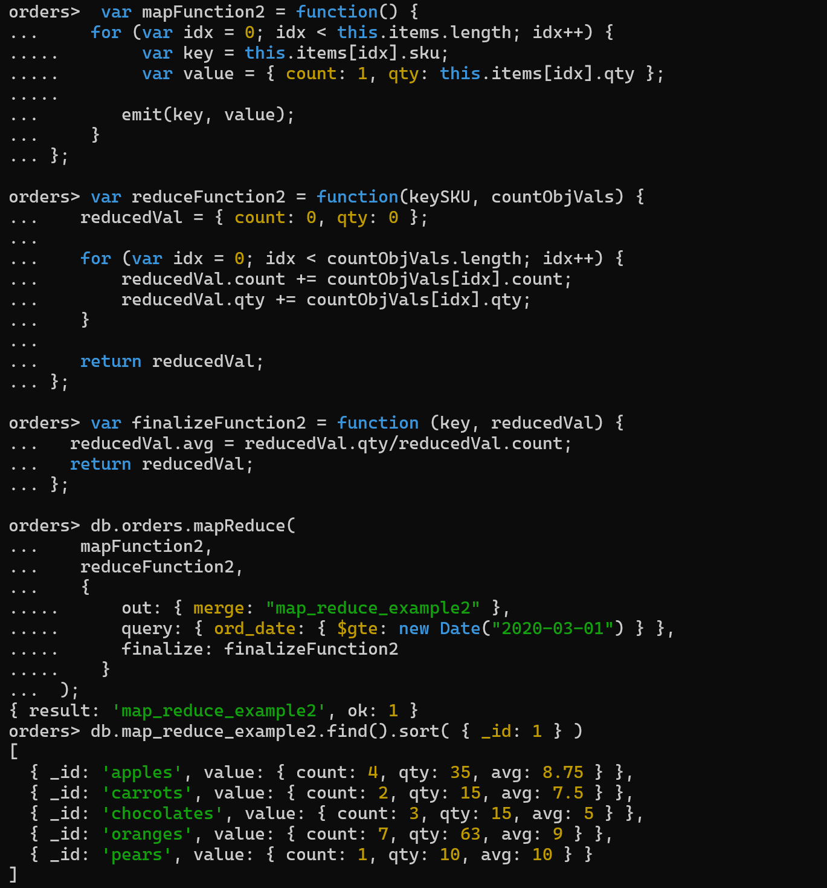
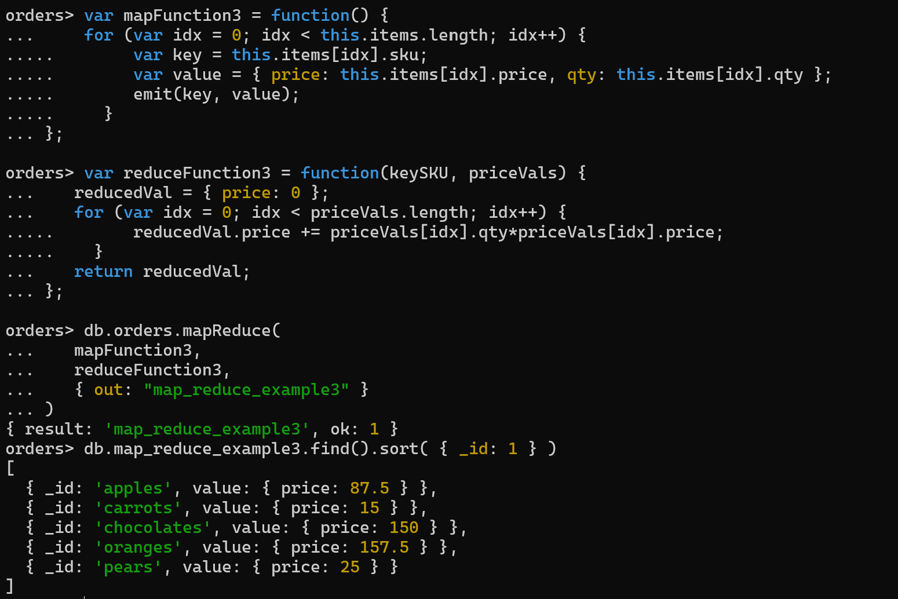

## Report for "Software Technology Experiment 3: Mongo DB":

### Technical Problems:
None :)

### Validation screenshot:

### Experiment 1 screenshot:
Insert documents:

Query documents:

Update documents:

Delete documents:

Bulk-write operations:

### Experiment 2 screenshot:

Additional operation:

Made an operation for giving the total price of the different items, summed for all the customers.
Might be useful if the group of customers want to know how much money they've spent in total on a certain item.

### Issues I did not manage to solve:
None :)